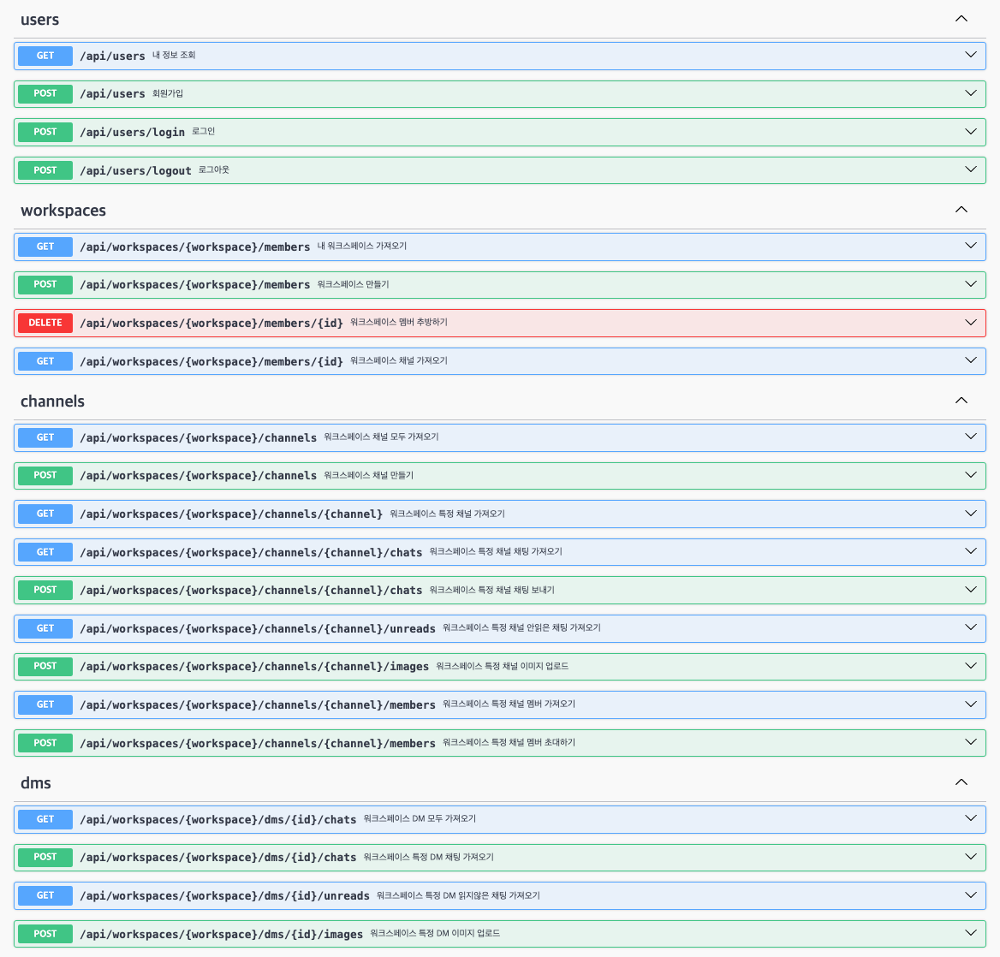

# Socket.io 연습용 프로젝트

슬랙 클론

## 주요 기능
- swagger 정리
- socket.io를 사용한 채팅 기능 (workspace, dm, channel등 다양한 namespace에서의 채팅)
- 로컬, SNS 회원가입

## 기술 스택

- Typescript 4.9.5
- Node.js 18.18.0
- NestJS 10.2.1
- Postgres 14.6
- Docker
- Git, Github

## API 목록

